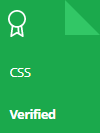

    

[//]: # (inspiration https://github.com/nathan-abela/HackerRank-Solutions)
## HakerRank-practice | Practice, Tutorials and Interview Preparation in JavaScript

This repository consists of solutions to HackerRank **practice**, **tutorials**, and **interview preparation** 
problems with **JavaScript** and **mySQL**

## Personal HackerRank Profile

[View Profile](https://www.hackerrank.com/fremen1990)

## HackerRank Badges

## HackerRank Certificates

[//]: # (## Table Of Contents)

[//]: # ()
[//]: # (* [Practices Completed]&#40;#practices-completed&#41;)

[//]: # (* [Tutorials Completed]&#40;#tutorials-completed&#41;)

[//]: # (* [Interview Preparation Kit]&#40;#interview-preparation-kit&#41;)

[//]: # (* [Certificates]&#40;#certificates&#41;)

[//]: # (COMMENTED )
[//]: # (## Practices Completed)

[//]: # ()
[//]: # (* [Python]&#40;#python&#41;)

[//]: # (* [Regex]&#40;#regex&#41;)

[//]: # (* [Security]&#40;#security&#41;)

[//]: # (* [SQL]&#40;#sql&#41;)

### 10 Days of JavaScript

|  Day  |            Challenge             |                                       Problem                                       | Difficulty | Score |                                                     Solution                                                      |
| :---: | :------------------------------: | :---------------------------------------------------------------------------------: | :--------: | :---: | :---------------------------------------------------------------------------------------------------------------: |
|   0   |          Hello, World!           |      [Problem](https://www.hackerrank.com/challenges/js10-hello-world/problem)      |    Easy    |  10   |             [Solution](/10%20Days%20of%20JavaScript/Day%200/01%20-%20Day%200%20-%20Hello,%20World.js)             |
|   0   |            Data Types            |      [Problem](https://www.hackerrank.com/challenges/js10-data-types/problem)       |    Easy    |  10   |              [Solution](/10%20Days%20of%20JavaScript/Day%200/02%20-%20Day%200%20-%20Data%20Types.js)              |

## Certificates

| Skill |                           Test                            | Difficulty |                                                               Description                                                               |                                     Certificate                                      |
|:-----:|:---------------------------------------------------------:|:----------:| :-------------------------------------------------------------------------------------------------------------------------------------: | :----------------------------------------------------------------------------------: |
|   CSS   | [Test](https://www.hackerrank.com/skills-verification/css) |    ---     |               It covers topics like exploring Cascading and Inheritance, exploring text styling fundamentals, understanding the use of layouts in CSS, understand the boxing of elements in CSS, among others.            |       [Certificate](https://www.hackerrank.com/certificates/b5e147157c86)        |

    

